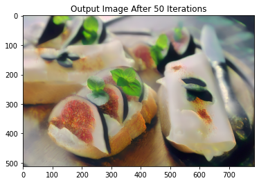

# Build a Neural Style Transfer with PyTorch

## Notes
The `requirements.txt` file should list all Python libraries that our models depends on, and they will be installed using:

```
pip install -r requirements.txt
```

## Behaviour
This project explains how to implement the `Neural Algorithm of Artistic Style` developed by Leon A. Gatys, Alexander S. Ecker and Matthias Bethge. Neural-Style, or Neural-Transfer, allows you to take an image and reproduce it with a new artistic style. The algorithm takes three images, an input image, a content-image, and a style-image, and changes the input to resemble the content of the content-image and the artistic style of the style-image.


## Principle
The principle is simple: we define two distances, one for the content `(Dc)` and one for the style `(Ds)`. `Dc` measures how different the content is between two images while `Ds` measures how different the style is between two images. Then, we take a third image, the input, and transform it to minimize both its content-distance with the content-image and its style-distance with the style-image. Now we can import the necessary packages and begin the neural transfer.


* `Convolutional Neural Network (CNN)` A given input image is represented as a set
of filtered images at each processing stage in the CNN. While the number of different filters
increases along the processing hierarchy, the size of the filtered images is reduced by some
downsampling mechanism (e.g. max-pooling) leading to a decrease in the total number of
units per layer of the network.<br>
* `Content Reconstructions` We can visualise the information
at different processing stages in the CNN by reconstructing the input image from only knowing the network’s responses in a particular layer. We reconstruct the input image from from
layers ‘conv1 1’ (a), ‘conv2 1’ (b), ‘conv3 1’ (c), ‘conv4 1’ (d) and ‘conv5 1’ (e) of the original VGG-Network. We find that reconstruction from lower layers is almost perfect (a,b,c). In
higher layers of the network, detailed pixel information is lost while the high-level content of the
image is preserved (d,e).<br>
* `Style Reconstructions` On top of the original CNN representations
we built a new feature space that captures the style of an input image. The style representation
computes correlations between the different features in different layers of the CNN. We reconstruct the style of the input image from style representations built on different subsets of CNN
layers ( ‘conv1 1’ (a), ‘conv1 1’ and ‘conv2 1’ (b), ‘conv1 1’, ‘conv2 1’ and ‘conv3 1’ (c),
‘conv1 1’, ‘conv2 1’, ‘conv3 1’ and ‘conv4 1’ (d), ‘conv1 1’, ‘conv2 1’, ‘conv3 1’, ‘conv4 1’
and ‘conv5 1’ (e)).<br><br>
This creates images that match the style of a given image on an increasing
scale while discarding information of the global arrangement of the scene.

## Steps
The notebook of project is divided on parts that are :
1. Importing Modules
2. Using CUDA
3. Loading the Images
4. Displaying the Images
5. The Content Loss Function
6. The Style Loss Function
7. Loading the Neural Network
8. Gradient Descent
9. Training Loop Function
10. Model Training
11. Model Evaluation

## Results
1. Style and Content Loss During Model Training :


2. Progression of Output Image During Training :

 
<br>
<br>

3. Final Output Image :

<p align="center">
    
    
</p>
<p align="center">
   
</p>

## Resources
* [A Neural Algorithm of Artistic Style - Leon A. Gatys, <br>Alexander S. Ecker, Matthias Bethge](https://arxiv.org/pdf/1508.06576.pdf)
* [NEURAL TRANSFER USING PYTORCH](https://pytorch.org/tutorials/advanced/neural_style_tutorial.html)
## Author
_Zakaria Mejdoul_


<br><br>_Enjoy creating images that match the style of a given image :exclamation: :rocket:_
